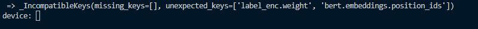

# image_searching

도커 없이 로컬에서 테스트 한 점 참고해주시면 되겠습니다. 

<br>

## 테스트 환경
CUDA_HOME=C:\Program Files\NVIDIA GPU Computing Toolkit\CUDA\v12.1 \
GPU: NVIDIA GeForce RTX 3060 \
PostgreSQL: 13.15 \
pgAdmin4 : v8.8


<br>

## Installation
python은 3.8버전 이상, pytorch는 1.7 이상, torchvision은 0.8버전 이상이 필요합니다.

Grounded SAM을 사용하기 위해 GroundingDINO와 Segment Anything을 모두 설치해야 합니다.
```
git clone https://github.com/IDEA-Research/GroundingDINO.git
git clone https://github.com/facebookresearch/segment-anything.git
```

<br>

현재 디렉토리에 clone 된 GroundingDINO, segment-anything에서 필요한 파일을 설치합니다.
```
python -m pip install -e segment-anything
python -m pip install -e GroundingDINO
```

<br>

이 때, visual studio 2019 'C++를 사용한 데스크톱 개발'이 설치돼있어야 GroundingDINO 의 dependency들을 설치할 수 있습니다. (만약 2022 버전에서 설치가 안되면 2019 버전으로 재설치해서 시도하면 될 것 같습니다.)


<br>

Segment Anything의 pretrained weights를 다운받습니다. (encoder: vit-h)

```
wget https://dl.fbaipublicfiles.com/segment_anything/sam_vit_h_4b8939.pth
```

<br> <br>
## 이미지 검색 Test
### database 연결
다음과 같이 API를 띄울 환경에 MySQL, PostgreSQL을 연결합니다.

* MySQL (MobaXterm에서 Tunneling)<br>

* PostgreSQL (pgAdmin에서 Tunneling)<br>


### API 실행
다음과 같은 코드로 FastAPI를 실행합니다.
```
uvicorn image_search_api:app
```

<br><br>


실행하면 터미널에서 사용할 gpu를 입력할 수 있습니다. 'cuda:0' 형식 활용하시면 될 것 같습니다.

<br>


### vector_base_uploader.py
현재 cdn에 저장된 이미지들을 불러와서 GroundedSAM -> Embedding -> DB에 삽입하는 파일입니다. 아래처럼 실행해주시면 되고, 위와 마찬가지로 실행 시 device 입력해주셔야 합니다. 
```
python vector_base_uploader.py
```

*TODO* : 다량의 한섬 이미지를 임베딩 할 때 GroundingDINO 파트에서 에러가 발생하고 있습니다. 에러가 나는 이미지 일부를 노트북 파일에서 똑같이 실행하여 에러를 추적하고자 하였으나 노트북 파일에서 실행할 땐 에러 없이 bbox 탐지를 잘 해줘서, 아직 정확한 원인을 파악하지 못한 상태입니다.