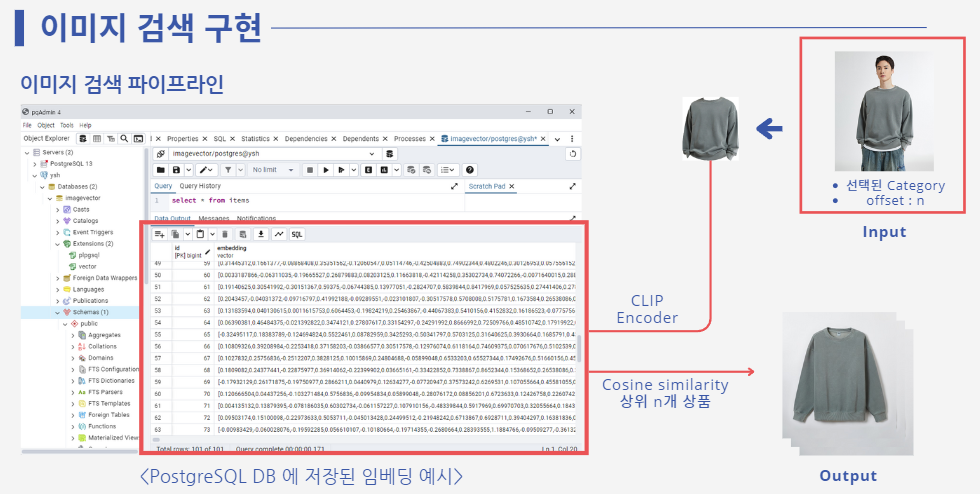
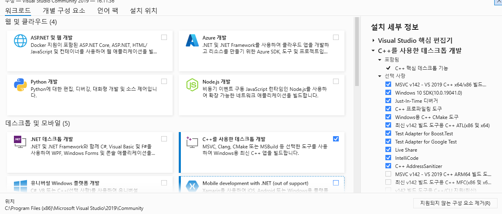
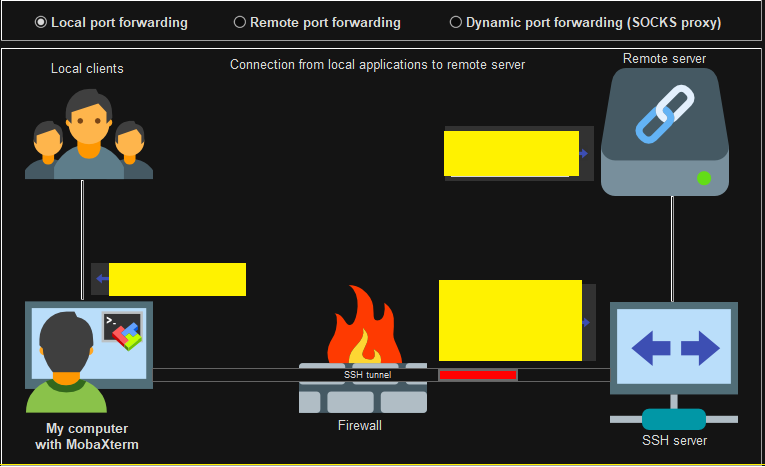
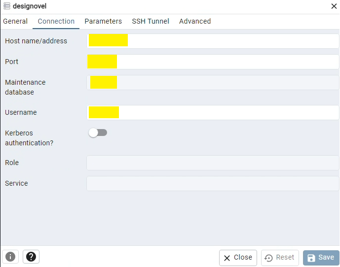
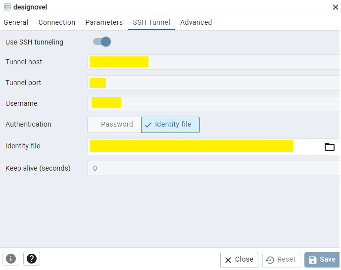
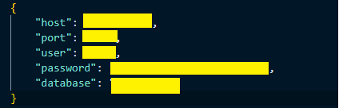
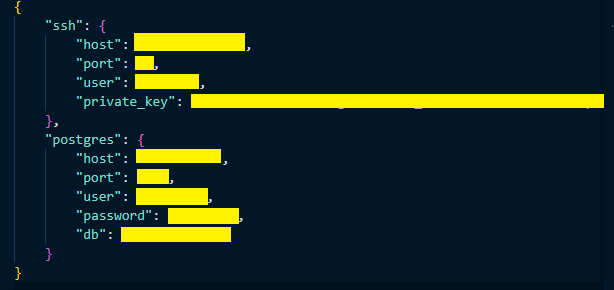

# image_retrieval



<br>

## 로컬에서 실행 시

### 테스트 환경
CUDA_HOME=C:\Program Files\NVIDIA GPU Computing Toolkit\CUDA\v12.1 \
GPU: NVIDIA GeForce RTX 3060 \
PostgreSQL: 13.15 \
pgAdmin4 : v8.8


<br> <br>

### Installation
python은 3.8버전 이상, pytorch는 1.7 이상, torchvision은 0.8버전 이상이 필요합니다.

Grounded SAM을 사용하기 위해 GroundingDINO와 Segment Anything을 모두 설치해야 합니다.
```
git clone https://github.com/IDEA-Research/GroundingDINO.git
git clone https://github.com/facebookresearch/segment-anything.git
```

<br>

현재 디렉토리에 clone 된 GroundingDINO, segment-anything에서 필요한 파일을 설치합니다.
```
python -m pip install -e segment-anything
python -m pip install -e GroundingDINO
```

<br>

이 때, visual studio 2019 'C++를 사용한 데스크톱 개발'이 설치돼있어야 GroundingDINO 의 dependency들을 설치할 수 있습니다. (만약 2022 버전에서 설치가 안되면 2019 버전으로 재설치해서 시도하면 될 것 같습니다.)



<br>

Segment Anything의 pretrained weights를 다운받습니다. (encoder: vit-h)

```
wget https://dl.fbaipublicfiles.com/segment_anything/sam_vit_h_4b8939.pth
```

<br> <br>
### 이미지 검색 Test
#### database 연결
다음과 같이 API를 띄울 환경에 MySQL, PostgreSQL을 알맞게 연결합니다.

* MySQL (MobaXterm에서 Tunneling)<br>
<br>



<br>

* PostgreSQL (pgAdmin에서 Tunneling)

<br>





### image_retrieval.sh 파일 수정
```
#!/bin/bash

export device="cuda:0"

uvicorn main:app --host 0.0.0.0 --port 8000
```
위 device 환경변수 값에 사용할 gpu를 입력합니다.

<br>

### API 실행
다음과 같은 코드로 sh파일을 실행합니다.
```
./image_retrieval.sh
```

<br>


####  vector_base_uploader.py 실행
현재 cdn에 저장된 이미지들을 불러와서 GroundedSAM -> Embedding -> DB에 삽입하는 파일입니다. embedding.sh 파일에서 device 값에 사용할 gpu를 설정 해 줍니다.
```
#!/bin/bash

python3 vector_base_uploader.py \
    --device cuda:0 \
```

그 후 sh 파일을 실행합니다.

```
./embedding.sh
```

<br><br>

## 도커로 실행 시

레포지토리 클론 후 image_retrieval 디렉토리에서 실행합니다.
```
cd image_retrieval
```

<br>

mysql_config.json 파일을 아래 형식으로 image_retrieval 하위에 작성합니다.


pg_config.json 파일을 아래 형식으로 image_retrieval 하위에 작성합니다.


<br>

### image_retrieval.sh 파일 수정
```
#!/bin/bash

export device="cuda:0"

uvicorn main:app --host 0.0.0.0 --port 8000
```
위 device 환경변수 값에 사용할 gpu를 입력합니다.

<br>

### embedding.sh 파일 수정
```
#!/bin/bash

python3 vector_base_uploader.py \
    --device cuda:0 \
```
device 값에 사용할 gpu를 설정 해 줍니다.

<br>

### dockerfile.api
이미지 검색 및 클러스터링 api 를 위한 dockerfile입니다. 아래와 같이 빌드 후 컨테이너를 생성하면 실행됩니다. 

```
docker build --no-cache -f dockerfile.api -t image_searching_api .
```
```
docker run --gpus all -d -p 8000:8000 --name image_searching_api image_searching_api
```


<br>

### dockerfile.embedding
cdn에 저장된 이미지들을 semantic segmentation 후 embedding 하기 위한 dockerfile입니다. 아래와 같이 빌드 후 컨테이너 생성하면 자동 실행됩니다.
```
docker build --no-cache -f dockerfile.embedding -t image_searching_embedding .
```
```
docker run --gpus all --network host -d --name image_embedding --restart unless-stopped image_searching_embedding
```
